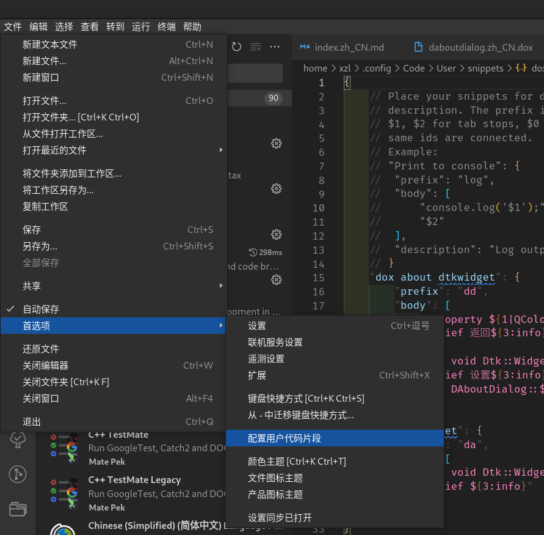

# vscode snipets 用户代码片段使用指南

## snipets简介

snipets 我愿意称为程序员的ctrl+c ctrl+v最大的竞争对手，sniptes适用于遇到很多重复代码却又没法去提取代码特点抽象成类的情况。比如写注释的时候。

这是一个极好的工具用于高效率~~办公~~（摸鱼）

## vscode 打开snipets



然后你就需要选择对应的语言，这里我以doxygen注释文件为例子：
打开之后会得到这样一个文件：

```jasonc
{
 // Place your snippets for doxygen here. Each snippet is defined under a snippet name and has a prefix, body and
 // description. The prefix is what is used to trigger the snippet and the body will be expanded and inserted. Possible variables are:
 // $1, $2 for tab stops, $0 for the final cursor position, and ${1:label}, ${2:another} for placeholders. Placeholders with the
 // same ids are connected.
 // Example:
 // "Print to console": {
 //  "prefix": "log",
 //  "body": [
 //   "console.log('$1');",
 //   "$2"
 //  ],
 //  "description": "Log output to console"
 // }
}
```

这个文件都是注释组成，自然也没有任何功能，我们要做的是对其进行修改，以支持我们自己的代码片段

## 代码片段的解读

先以一个比较简单的例子作为内容：

```json
{
 // Place your snippets for doxygen here. Each snippet is defined under a snippet name and has a prefix, body and
 // description. The prefix is what is used to trigger the snippet and the body will be expanded and inserted. Possible variables are:
 // $1, $2 for tab stops, $0 for the final cursor position, and ${1:label}, ${2:another} for placeholders. Placeholders with the
 // same ids are connected.
 // Example:
 // "Print to console": {
 //  "prefix": "log",
 //  "body": [
 //   "console.log('$1');",
 //   "$2"
 //  ],
 //  "description": "Log output to console"
 // }
 "dox dtkwidget": {
  "prefix": "da",
  "body": [
   "@fn void Dtk::Widget::DAlertControl::${2:function}",
   "@brief ${3:info}"
  ]
 }
}
```

我们来逐行解释：dox dtkwidget指的是这个代码片段的命名，你可以使用任何你喜欢的命名来代替它

然后就是一个键值对 "prefix" 的值一般是一个字符串，这个字符串也是可以自定义的，含义就是你在代码文件里面输入这个字符串（在某一行的开头）后会弹出选项询问你是否使用代码片段：比如这个就是da,你在某一行的开头打出da这俩字符，就会弹窗询问你是否替换


同时会显示对于代码片段的命名

body键值对就是最重要的一部分，这个里面就保存的你需要的代码片段，

请注意，其中每一行都代表的是你之后生成的代码的一行，如上代码片段生成的代码就是

```
@fn void Dtk::Widget::DAlertControl::function
@brief info
```

如果你现在已经复制了我的代码片段，不妨新建一个dox文件试试。打出da之后会弹出选项，按tab键确认之后就会出现这个代码，不过会让你填写function的值，填写完毕之后就按tab键切换到info需要你填写info的值

不过这样还不是代码片段的全部实力，它还能更强大点：

```json
 "dox about dtkwidget": {
  "prefix": "dd",
  "body": [
   "@property ${1|QColor,void,bool|} Dtk::Widget::DAlertControl::${2:function}",
   "@brief 返回${3:info}",
   "",
   "@fn void Dtk::Widget::DAlertControl::set${2/(.*)/${1:/capitalize}/i}",
   "@brief 设置${3:info}",
   "@sa DAboutDialog::${2:function}"
  ]
 }
```

比如这样

你可以自己试试这个会发生什么

对的 它还支持正则表达式的替换

现在看看我正在用的doxygen的代码片段

```jsonc
{

 "dox about DtkGui": {
  "prefix": "dd",
  "body": [
   "@property Dtk::Gui::DDciIconPalette::${2:function}",
   "@brief ${2}属性",
   "@sa READ方法: void Dtk::Widget::DDciIconPalette::${2:function}",
   "@sa WRITE方法: void Dtk::Widget::DDciIconPalette::set${2/(.*)/${1:/capitalize}/i}",
   "",
   "@fn ${1|QColor,void,bool|} Dtk::Widget::DDciIconPalette::${2:function}",
   "@brief 返回${3:info}",
   "@sa DDciIconPalette::${2:function}",
   "",
   "@fn void Dtk::Widget::DDciIconPalette::set${2/(.*)/${1:/capitalize}/i}",
   "@brief 设置${3:info}",
   "@sa DDciIconPalette::${2:function}"
  ]
 },
 "dox dtkwidget": {
  "prefix": "da",
  "body": [
   "@fn void Dtk::Widget::DDciIconPalette::${2:function}",
   "@brief ${3:info}"
  ]
 }
}
```
我可以通过这个代码片段一键生成属性的get和set方法的doxygen注释
